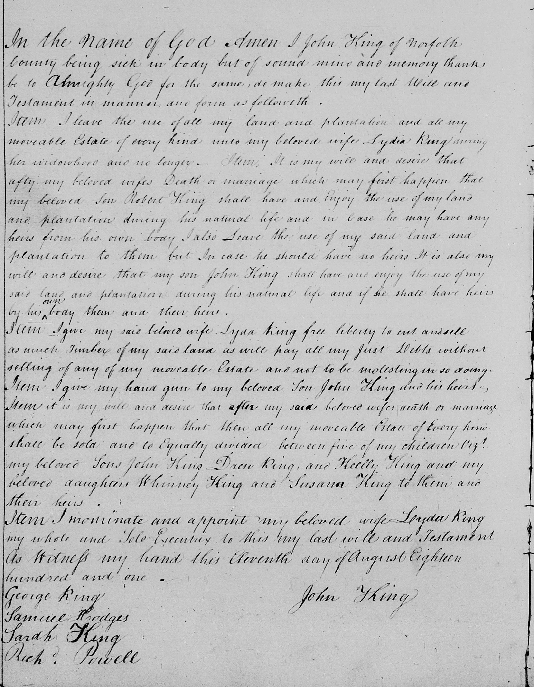
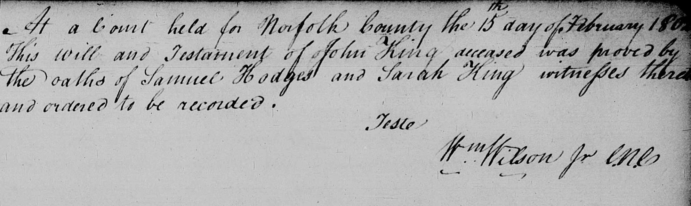

#   
#   
 In the Name of God Amen I John King of Norfolk County being  
sick in body but of sound mind and memory thanks be to Almighty God for the same ,  
do make this my last Will and Testament in manner and form as followeth Item I leave  
the use of all my land and plantation and all my moveable Estate of every kind unto my  
beloved wife Lydia King during her widowhood and no longer . Item , It is my will and  
desire that afty my beloved wifes Death or marriage which may first happen that my  
beloved son Robert King shall have and enjoy the use of my land and plantation during  
his natural life and in case he may have any heirs from his own body I also leave the  
use of my said land and plantation to them but In case he should have no heirs It is also  
my will and desire that my son John King shall have and enjoy the use of my said land  
and plantation during his natural life and if he shall have heirs by his #( body them and  
their heirs . Item I give my said beloved wife Lyda King free liberty to cut and sell as  
much Timber of my said land as will pay all my Just Debts without selling of any of my  
moveable Estate and not to be molesting in so doing Itemd I give my hand gun to my  
beloved son John King and his heirs Item it is my will and desire that after my said  
beloved wifes death or marriage which may first happen that then all my moveable  
Estate of Every kind , shall be sold and to Equally divided between five of my children  
Viz my beloved sons John King Drew King , and Kelly King and my beloved daughters  
Whinney King and Susana King to them and their heirs Item I nominate and appoint my  
beloved wife Lyda King my whole and Sole Executrix to this my last will and Testament  
as witness my hand this Eleventh day of August Eighteen hundred and one . George  
Ping John Thing Samuel Hodges Sarah King Richd Powell At a Court held for Norfolk  
County the 15th day of February 1 #( This will and Testament of John King deceased was  
proved the oaths of Samuel Hougs and Sarah King unissed ins and ordered to be  
recorded . Teste Wm Wilson  
